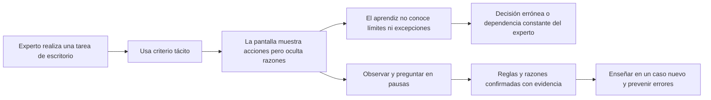
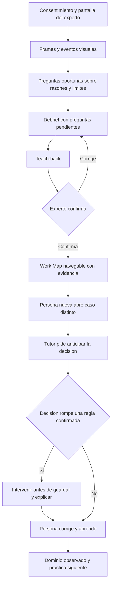

# Roadmap: de problema entendido a entrega el 4 de octubre a las 06:00

**Solicitud vigente:** definir primero el problema, explorar/pivotear ideas, cerrar un mapa y después ejecutar. La aplicación todavía no se ha empezado. Este documento es el plan de ejecución, no una declaración de progreso completado.

**Límite corregido por el usuario: 4 de octubre de 2026 a las 06:00, America/Mexico_City (12:00 UTC).** Esta precisión sustituye el cálculo inicial de 15 horas. T0 registrado se conserva: **3 de octubre de 2026, 13:41:57 local** (19:41:57 UTC). El presupuesto total es **16 h 18 min 3 s**. No se reinicia el reloj. La tabla conserva el plan base de 15 horas con objetivo interno de entrega a las 04:42; el margen adicional queda para verificación y contingencias, con la última hora protegida de **05:00 a 06:00**. El nombre de archivo conserva el enlace del plan original. Falta conocer el canal oficial y contrastar las bases del evento; no hay automatización programada.

**Capacidad confirmada:** tres personas. Abraham + Persona 2 + Persona 3; nombres y especialidades de las otras dos personas pendientes. Claude y Codex son herramientas de apoyo, no se cuentan como miembros humanos adicionales. Se verificó acceso a ElevenLabs en Chrome y una lista visible vacía; la inspección directa por MCP está pendiente de OAuth. Todavía no se ha elegido agente ni LLM para el producto. La tabla es una distribución de tiempo, no una garantía de terminación.

## 1. Mapa del problema

**Problema formulado:** una persona nueva no puede reconstruir el criterio de un experto solo observando clics o leyendo un procedimiento desactualizado. Necesita saber por qué actuar, cuándo cambiar de decisión y cuándo detenerse.

**Usuarios y resultados:**
- Experto: transmitir razones y excepciones sin interrumpir continuamente su trabajo; poder corregir o retirar información.
- Persona nueva: resolver una variante que nunca vio, explicar su decisión y reconocer cuándo consultar.
- Organización: conservar conocimiento trazable y evitar errores de operación.
- Juez: poder comprobar el recorrido, las fuentes del conocimiento y la transferencia, sin depender de una explicación verbal del equipo sobre algo que no funciona.

**Hechos del brief:** tres módulos; voz ElevenLabs; preguntas situadas; debrief confirmado; mapa con evidencia; caso nuevo; intervención previa al guardado; privacidad; moonshot. Véase `docs/CHALLENGE.md`.

**Hipótesis de diseño por validar:** una tarea acotada y un sandbox propio ofrecen suficiente contexto visual y control del guardado; el experto puede expresar sus reglas en una sesión corta; un mapa estructurado permite al tutor razonar sobre variantes. Ninguna está demostrada todavía.

**Exclusiones del MVP:** soporte universal a cualquier aplicación, automatización autónoma completa, ERP completo, múltiples expertos, traducción entre idiomas, panel corporativo, app móvil, analítica histórica y exportación avanzada para otros agentes. La corrección del plazo no amplía el alcance.

## 2. Alternativas antes de decidir

Todas deben completar el mismo recorrido Capture–Map–Teach. La elección de caso sigue abierta.

| Opción | Conocimiento que aprendería | Guardrail demostrable | Caso nuevo | Riesgo a validar |
|---|---|---|---|---|
| Facturas con excepciones | Clasificación, retenciones, aprobaciones y condiciones | Frenar una clasificación o registro incorrecto antes de guardar | Importe/proveedor distinto a los usados en captura | Entender bien las reglas del escenario y no fingir asesoría contable universal |
| Escalaciones de soporte | Cuándo resolver, escalar o consultar y qué señales lo justifican | Frenar cerrar o enviar una respuesta que exige escalación | Ticket con combinación nueva de señales | Disponer de un experto y criterios suficientemente concretos |
| Aprobación de compras | Límites de gasto, proveedor y aprobadores | Frenar aprobar una solicitud sin cumplir una condición | Solicitud nueva con otra combinación de importe/proveedor | Evitar que construir el proceso auxiliar consuma el plazo |

**La ventaja inicial de facturas** es que el propio brief incluye ejemplos y una demo de referencia; esto no equivale a una elección del usuario. Si el equipo conoce otro flujo con criterio real y casos disponibles, esa evidencia puede justificar preferirlo.

Aplicar la matriz ponderada de `docs/WORKFLOW.md`. Evaluar conocimiento disponible y control de la demo antes de sofisticación. A T+1:10 debe haber una opción principal y una alternativa. Si no hay evidencia para una opción propia, el ejemplo del brief es el fallback propuesto, no una decisión ya tomada.

## 3. Mapa de la experiencia antes de código

**Estados mínimos de interfaz:** sin permiso, capturando, pausa/silencio, pregunta, debrief, pendiente de confirmación, mapa confirmado, enseñanza, intervención y cierre. Debe existir forma de pausar y retirar contenido; el diseño de sus efectos se cierra antes de integrar datos.

**Contrato conceptual preliminar, sin stack fijado:**
- `ScreenEvent`: identificador, sesión, timestamp, qué cambió y referencia visual.
- `ExpertStatement`: autor, texto, timestamp, referencia a evidencia y estado de exclusión.
- `Decision`: contexto, elección, razón atribuida y evidencias.
- `Guardrail`: condición, acción permitida/prohibida o escalación, fuente y confirmación.
- `WorkStep`: orden, evento, decisión, razón, guardrails y enlaces de evidencia.
- `WorkMap`: versión, pasos, vacíos pendientes y confirmación del experto.
- `TeachingAttempt`: caso nuevo, predicción del aprendiz, decisión, intervención previa al guardado y resultado.

Esto es un mapa para acordar responsabilidades; no obliga a una base de datos ni sustituye la ontología. Diferenciar observación, interpretación del modelo y regla confirmada. Ningún guardrail crítico se presenta como confirmado si el experto no lo validó.

**Historia a dibujar en papel:** dos o tres casos de captura → tres preguntas pertinentes → debrief de tres preguntas nuevas → corrección de una regla → mapa confirmado → caso reservado nuevo → intento erróneo → intervención → corrección → cierre. Las cantidades exactas de facturas del ejemplo no son universales; se conservan los mínimos del brief.

## 4. Roadmap con salidas verificables

| Ventana | Hora local aproximada | Trabajo y responsable propuesto | Salida para avanzar |
|---|---|---|---|
| T+0:00–0:30 | 13:42–14:12 | Abraham + apoyo de agentes: delimitar dolor, experto, tarea, regla y criterio de éxito; confirmar deadline/accesos | Ficha del problema; restricciones conocidas; dudas marcadas |
| T+0:30–1:10 | 14:12–14:52 | Equipo: comparar hasta tres opciones y pivotear con evidencia | Una opción principal, alternativa y motivo registrado |
| T+1:10–1:45 | 14:52–15:27 | Tres personas con apoyo de Codex/Claude: mapear experiencia, conocimiento, contratos y casos | Mapa completo; criterio para debrief y preguardado; alcance congelado |
| T+1:45–3:00 | 15:27–16:42 | Persona 2: integración mínima; Persona 3: contrato/reglas; Abraham: experto | Voz real + evento visual en contexto + una razón capturada + viabilidad de intervención previa al guardado |
| T+3:00–5:30 | 16:42–19:12 | Persona 2: Capture; Persona 3: Map contra el contrato; Abraham: preguntas | Tres preguntas en pausas, una de guardrail; eventos y respuestas con timestamps |
| T+5:30–8:00 | 19:12–21:42 | Persona 3: Map; Persona 2: integración/evidencia; Abraham: confirmación | Tres preguntas nuevas; teach-back corregible; mapa navegable con fuentes |
| T+8:00–10:30 | 21:42–00:12 del 4 oct. | Persona 3: tutor; Persona 2: sandbox/intervención; Abraham: caso nuevo | Tutor detecta un error antes del guardado y explica la regla del experto |
| T+10:30–12:00 | 00:12–01:42 | Equipo: integrar recorrido, verificar privacidad y recuperación de errores | E2E completo; contenido excluido no reaparece; errores de permiso/conexión manejados |
| T+12:00–13:00 | 01:42–02:42 | Abraham como juez; Personas 2 y 3 corrigen con apoyo de agentes | Checklist mínimo pasa con caso nuevo y evidencia anotada |
| T+13:00–14:00 | 02:42–03:42 | Abraham: pitch y entrega; Personas 2 y 3: documentación/despliegue | Demo ensayada, slide moonshot, enlaces y paquete según bases oficiales |
| T+14:00–15:00 | 03:42–04:42 | Equipo: subir, comprobar recepción y recuperar fallos | Objetivo interno de entrega confirmada; solo correcciones de bloqueo, sin nuevas funciones |

**Margen añadido por la corrección del límite:**

| Ventana local | Uso | Salida |
|---|---|---|
| 04:42–05:00 | Verificar paquete, enlaces, accesibilidad de demo y recepción; resolver bloqueos | Paquete listo o ya recibido; ninguna función nueva |
| 05:00–06:00 | Última hora reservada para entrega, contingencias y comprobante | Entrega recibida antes de las 06:00 |

Los horarios mostrados están redondeados al minuto. La extensión exacta desde el fin del plan base es 1 h 18 min 3 s. Si ya se entregó correctamente a las 04:42, no hace falta esperar al límite.

**Reloj real:** el tiempo consumido desde la confirmación del usuario pertenece a la primera ventana. Si aparece una hora oficial diferente, recalcular sin ocultar tiempo consumido y confirmar la diferencia. Si se llega tarde a un hito, activar recorte en el checkpoint; no robar automáticamente la hora de entrega.

## 5. Cinco checkpoints que deciden continuidad o pivote

- **T+1:45 — problema y mapa cerrados:** si no hay opción, datos de prueba y cadena completa, simplificar a un caso conocido; no seguir ideando interfaces.
- **T+3:00 — riesgo principal resuelto:** si voz+pantalla no funciona, diagnosticar la dependencia y reducir complejidad técnica. Cambiar proveedor de visión o usar datos de sandbox puede ser viable; sustituir una demo funcional por un video presentado como en vivo no cumple.
- **T+8:00 — conocimiento usable:** si el mapa no tiene fuentes y confirmación, detener mejoras visuales e integrar esos requisitos antes de expandir Teach.
- **T+10:30 — transferencia demostrada:** si no puede prevenirse el guardado con screenshots, usar la señal de preguardado del sandbox acordado. Declarar ese alcance; no prometer control universal de otras aplicaciones.
- **T+13:00 — congelación:** solo fallos que impidan requisitos esenciales, arranque o entrega. Prohibido iniciar stretch goals.

## 6. Qué recortar y qué conservar

**Primeros recortes:** animaciones, branding adicional, cuentas de usuario sofisticadas, integraciones con software empresarial real, más dominios, más idiomas, comparación de expertos, búsqueda avanzada y automatización generalista.

**No recortar como si fueran opcionales:** Capture, Map, Teach; tres preguntas situadas en vivo (una de guardrail); tres preguntas nuevas en debrief; teach-back confirmado; cada paso/guardrail con evidencia; caso nuevo; error detectado antes del guardado; explicación del experto; respuesta sobre privacidad y retirada; cierre de aprendizaje; slide de moonshot.

**Si trabaja solo una persona:** conservar el mismo caso acotado y secuenciar módulos; reducir interfaz y persistencia a lo estrictamente necesario para reproducir la demo. Las asignaciones paralelas de la tabla no se consideran capacidad confirmada. Si el tiempo resulta insuficiente, reportar qué requisito queda sin cumplir; no renombrarlo como opcional.

## 7. Reparto y coordinación

- Abraham: define criterio del dominio, decide entre opciones, confirma permisos/cuentas, actúa como experto y juez, prepara relato y realiza/confirma la entrega oficial.
- Persona 2, propuesta: shell de aplicación, captura/eventos, integración y punto de intervención antes de guardar; mantiene el contrato compartido y CI. Puede usar Codex como apoyo.
- Persona 3, propuesta: debrief, estructura del Work Map y tutor, contra el contrato acordado. Puede usar Claude como apoyo.
- Propiedad de archivos: asignar carpetas por componente al escoger stack. Cambios al contrato requieren registro y aviso al otro responsable antes de integrar. No dos agentes en una rama.
- GitHub: issue por resultado verificable, rama propia, código y bitácora en cada commit, PR con evidencia. Las conversaciones no se sincronizan solas.

No se han enviado tareas a otros chats ni se ha iniciado desarrollo del producto. El reparto entre Personas 2 y 3 es una propuesta hasta conocer sus nombres y habilidades.

## 8. Matriz compacta de verificación final

| Requisito | Prueba concreta |
|---|---|
| Preguntas con buen timing | Tres momentos registrados durante pausas; ninguna pregunta mientras el experto habla/escribe |
| Descubrir criterio | Una pregunta explícita sobre límite/excepción y respuesta atribuida |
| Cerrar vacíos | Tres preguntas nuevas al terminar; incertidumbres resueltas o claramente marcadas |
| Comprensión confirmada | Experto corrige/acepta el teach-back y se conserva esa versión |
| Work Map verificable | Cada paso/regla permite abrir pantalla y explicación del experto |
| Transferencia | Caso reservado que nunca se mostró en Capture |
| Prevención | Error inducido detectado antes del guardado, con explicación basada en la regla aprendida |
| Aprendizaje | Persona anticipa decisiones y recibe cierre con dominio/práctica pendiente |
| Confianza | Pausar/retirar contenido y comprobar que no se usa después; datos de prueba ficticios |
| Pitch | Cinco preguntas del Apprentice Test respondidas y una slide de moonshot |
| Entrega | Arranque/despliegue verificado, enlaces correctos y recepción por el canal oficial |

## 9. Riesgos y datos por confirmar al inicio

1. El usuario corrigió el límite a las 06:00 del 4 de octubre; falta el canal oficial y comprobar que las bases coincidan. El cálculo anterior queda sustituido según ADR-0007.
2. Hay tres personas confirmadas; faltan nombres, especialidades y turnos de las otras dos.
3. ElevenLabs accesible en Chrome, sin agentes en la lista visible consultada. El usuario prefiere MCP; completar OAuth y comprobar el workspace antes de elegir agente/LLM. Véase docs/READINESS.md. No bloquear la definición del problema mientras termina la conexión.
4. Experto o conocimiento real del flujo elegido; el modelo no debe inventar reglas que nadie confirmó.
5. Pausas: silencio no demuestra que alguien dejó de leer. Diseñar señales y control del experto.
6. Preguardado: una captura cada 1–2 segundos puede llegar tarde. Diseñar el punto de intervención desde el mapa.
7. Privacidad: retirada de un segmento afecta también reglas/mapas derivados; definir la conducta antes de almacenar todo.
8. Hosting/demo: permisos de pantalla/micrófono y dispositivo real de los jueces; probarlos con margen.

## 10. Estado del harness y trabajo preservado

La versión estable existente ya da instrucciones compartidas, bitácora, ADRs, ontología, hooks, PRs y CI; basta para registrar este roadmap. Las ampliaciones de tareas/relevos v2 del issue #2 quedan diferidas para no consumir el plazo del producto antes de cerrar el mapa.

Se preservó el trabajo incompleto localmente en un stash identificado como `WIP harness coordination preserved before 15h problem-mapping roadmap`, asociado a la rama `codex/harness-coordination`. Contiene código y contexto todavía sin validar; no se publica como funcional ni se requiere para seguir este plan. Al retomarlo, usar `git stash list` para identificarlo por mensaje, aplicarlo en esa rama y resolver cualquier diferencia de contexto; no asumir que sigue siendo `stash@{0}`.

El siguiente paso de este plan es completar la ficha del problema y comparar las tres opciones. Crear más infraestructura del harness solo se justifica si elimina un bloqueo concreto del equipo.
